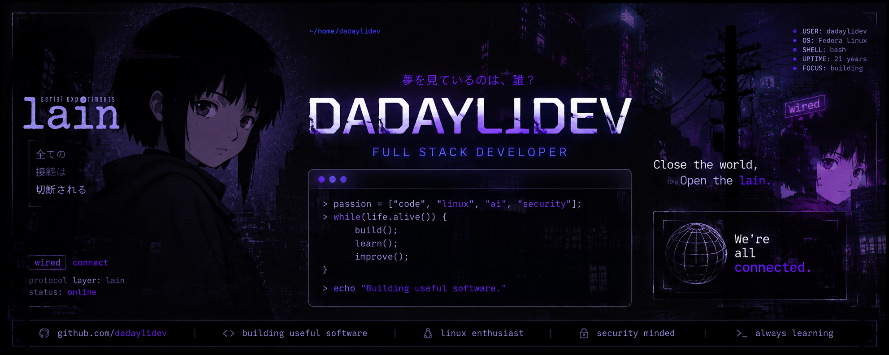

<div align="center">



<br>

# DadaylıDev


<br>


<br><br>


</div>

---

# > terminal

```bash
$ whoami
DadaylıDev

$ hostnamectl
Operating System : Fedora Linux

$ languages
HTML • CSS • JavaScript • TypeScript
PHP • Python

$ frameworks
React • Next.js • Laravel • Flutter

$ tools
Git • GitHub • Docker • MySQL • VS Code

$ interests
Artificial Intelligence
Cyber Security
Linux
Open Source

$ status
Building useful software...
```

---

# 🛠 Tech Stack

<div align="center">


</div>

---

# 🎵 Now Playing

<div align="center">

<!-- Spotify widget kodunu buraya yapıştır -->


</div>

---

<div align="center">

> **Let's all love Lain.**

</div>
